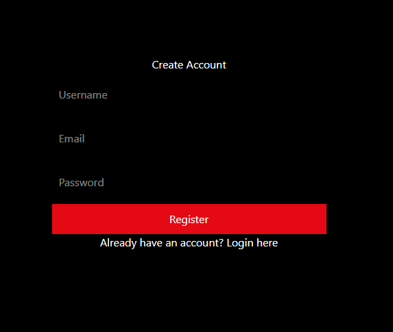
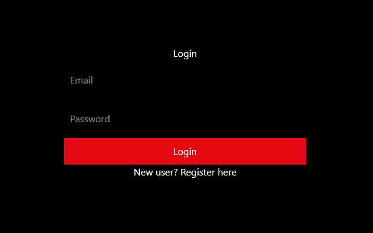
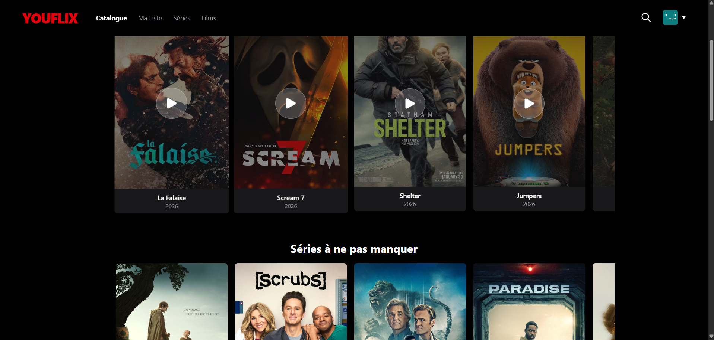
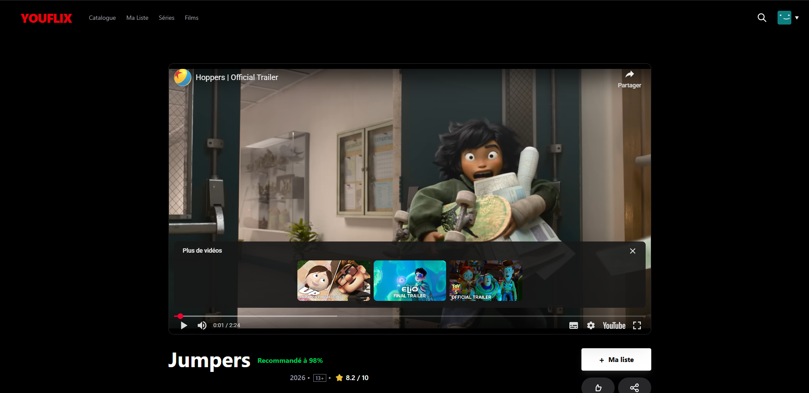
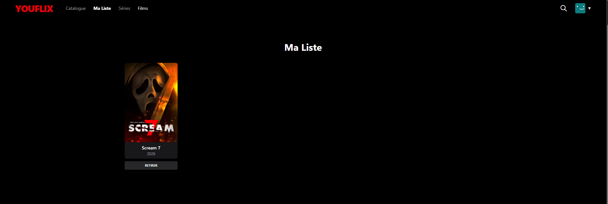
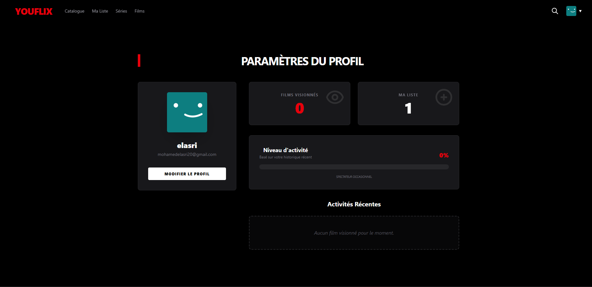

# 🎬 Plateforme de Streaming Vidéo – React.js

## 📌 Contexte du projet

Une plateforme de streaming vidéo souhaite développer une application web moderne permettant aux utilisateurs de découvrir, visionner et gérer leur expérience de visionnage de films, séries et documentaires.

L'application affiche les trailers des contenus hébergés sur YouTube (via URL embed), sans upload ou stockage de fichiers vidéo.

Application 100% Frontend développée avec React.js.

---

## 🚀 Objectifs du projet

- Développer une SPA moderne avec React.js
- Gérer l’état global sans backend
- Stocker les données dans localStorage
- Offrir une expérience utilisateur fluide et responsive
- Implémenter l’authentification côté frontend

---

## 🏗️ Stack Technique

- React.js
- React Router DOM
- Hooks (useState, useEffect, useContext)
- Custom Hooks (useAuth, useLocalStorage)
- LocalStorage
- CSS / Tailwind / Styled Components (selon implémentation)
- YouTube Embed (trailers uniquement)

---

## 📂 Structure du projet

```
src/
│
├── components/
├── pages/
├── hooks/
├── context/
├── services/
├── data/
├── utils/
└── App.jsx
```

---

## 🧩 Entités Principales

### 👤 User
- id
- username
- email
- password

### 🎥 Video
- id
- title
- description
- thumbnailUrl
- trailerUrl (YouTube embed)
- duration
- releaseYear
- type (FILM / SERIE / DOCUMENTAIRE)
- category
- rating
- director
- cast

### 🗂️ Category
- id
- name  
Exemples : Action, Comédie, Drame, Science-Fiction, Thriller, Documentaire, Horreur

### ⭐ Watchlist
- id
- userId
- videoId
- addedAt


### 📺 WatchHistory
- id
- userId
- videoId
- watchedAt
- progressTime
- completed

---

## 🔐 Fonctionnalités

### ✅ Authentification
- Formulaire de connexion
- Formulaire d'inscription
- Validation des champs en temps réel
- Stockage des utilisateurs dans localStorage
- Gestion de session
### 📝 Page Register


### 🔐 Page Login


### 🏠 Page d’accueil (Catalogue)
- Grille de contenus
- Filtres (type, catégorie)
- Barre de recherche avec suggestions
- Tri (récents, mieux notés, popularité)


### 🎬 Détails d’un contenu
- Informations complètes
- Lecteur YouTube embed (trailer)
- Ajouter / Retirer de Ma Liste
- Système de notation
- Contenus similaires



### 📌 Ma Liste (Watchlist)
- Affichage des contenus ajoutés
- Suppression d’éléments
- Indicateur de visionnage


### 👤 Profil Utilisateur
- Informations du compte
- Statistiques de visionnage
- Historique


---

## ⚙️ Exigences Techniques Respectées

- Composants fonctionnels avec Hooks
- Custom Hooks :
  - useAuth
  - useLocalStorage
- Protection des routes privées
- Lazy loading des routes
- Responsive Design
- Validation dynamique des formulaires
- Gestion complète de l’état côté frontend
- Aucune API backend

---

## 🛠️ Installation et Lancement

### 1️⃣ Cloner le projet

```bash
git clone <lien-du-repo>
cd nom-du-projet
```

### 2️⃣ Installer les dépendances

```bash
npm install
```

### 3️⃣ Lancer le projet

```bash
npm start
```

ou

```bash
npm run dev
```

---

## 🎯 Points Clés du Projet

- Application 100% Frontend
- Données persistées avec localStorage
- Gestion complète de l’authentification sans backend
- UI/UX moderne et responsive
- Architecture propre et modulaire


---

## 📅 Informations Pédagogiques

- Projet individuel
- Durée : 5 jours
